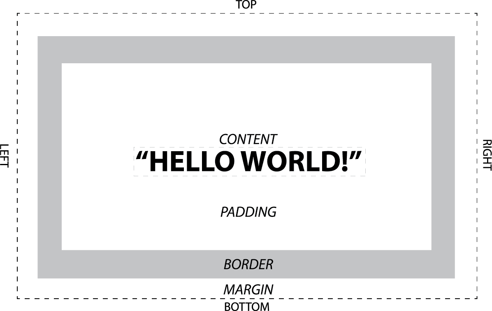

Bootcamp Web Class Day 04: More CSS Properties, The Box Model, & Positioning
=====

## Agenda

### house keeping

- Talk about mid-term: portfolio site:
  - Fito "If you considered yourself a website how would you look? the way you think, talk, look, world outlook?" 
  - ie: be more creative

- Hack your neighbor’s website!

- CSS property for list items: `list-style-type: none;` for making lists not have bullets ( + numbers? )

### to cover

- more CSS properties

- Box Model

- Positioning

- Display

## More CSS Properties

## Box Model

- Fito's presentaiton has a good diagram.
- MDN article on box model.
- Width doesn't include margin, only content + padding + border.
- using `box-sizing: border-box'` to alter how the `width` property affects the box model 

## Positioning

From [A List Apart, CSS Positioning 101](http://alistapart.com/article/css-positioning-101)

- "Think of a “box,” as described by the spec as a wooden block—not unlike the ones you played with as a young whippersnapper. Now, think of the normal flow as a law similar to the law of gravity. The normal flow of the document is how your elements stack one on top of each other, from the top down, in the order in which they appear in your markup. You may remember stacking alphabet blocks into giant towers: The normal flow is no different than those wooden blocks bound by the law of gravity. As a child, you had one block on top of another; in your markup, you have one element after another. What you couldn’t do as a child, however, was give those blocks properties that could defy the law of gravity. All of the sudden, CSS seems a lot cooler than those alphabet blocks."

### Position: Static
- the default position, in the flow. Stacks one on top of the next.
- useful for single column layouts when each element stacks on top of another.
- can't use offset properties: top, bottom, right, left

### Position: Relative
- behave similarly as static positioned elements
- but they allow for us to adjust the position using the offest properties.
- shifting relatively positioned elements doesn't affect the elements after it.
- also allows for changing the __coordinate system__ of an element.
  - positioning an element relative inside another element will set it's 0,0 to it's parent's position.
  
### Position: Absolute
- takes an element out of the normal document flow. 
- bound by parent element or document.
- postioned with offset properties.

### Position: Fixed
- makes an element stick to the viewport when the user scrolls.
- can combine with the `z-index` property to create headers and footers that don't move

### Note:
From [MDN](https://developer.mozilla.org/en-US/docs/Web/CSS/position): "For __relatively positioned__ elements, the top or bottom property specifies the vertical offset from the normal position and the left or right property specifies the horizontal offset.

For __absolutely positioned__ elements, the top, right, bottom, and left properties specify offsets from the edge of the element's containing block (what the element is positioned relative to). The margin of the element is then positioned inside these offsets.

Most of the time, __absolutely positioned__ elements have auto values of height and width computed to fit the contents of the element. However, non-replaced __absolutely positioned__ elements can be made to fill the available space by specifying (as other than auto) both top and bottom and leaving height unspecified (that is, auto). Likewise for left, right, and width."

## Display

The two most important ways to alter a display:

- none
- inline-block

more about displays in the next lecture.